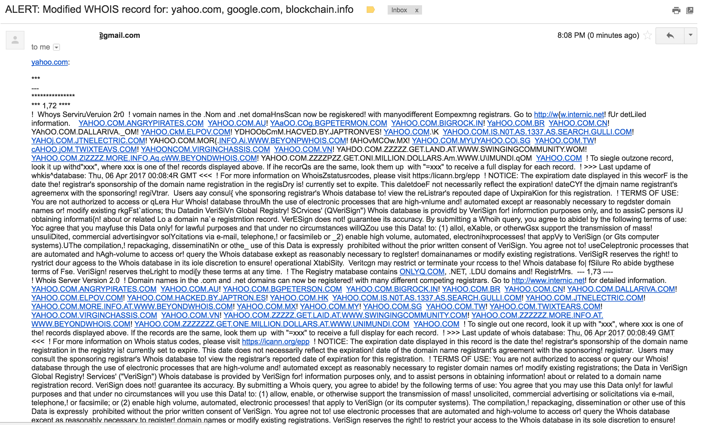

# whoisalert

Provide a list of domains and get an alert when WHOIS records for any of those
domains changes.

## Usage

    $ python app.py [--simulate_change] [--simulate_cooldown n] domainlist.txt recipient@example.com

Expects the following environment variables set:

 * WHOISALERT_SMTP_USERNAME
 * WHOISALERT_SMTP_PASSWORD
 * WHOISALERT_SMTP_SERVER (Optional: Defaults to 'smtp.gmail.com')
 * WHOISALERT_SMTP_PORT (Optional: Defaults to 465)


There are two simulation options which can help you verify that your alert ought
to work correctly before an alert state occurs in reality:

 * The `--simulate_change` option simulates an change to the WHOIS record so you
can verify that your alert system is working correctly.

* The `--simulate_cooldown` option simulates a reply from a WHOIS server that
enforces a cooldown period of `n` seconds before it will give updated data.

Either the `--simulate_change` option or the `--simluate_cooldown` option may
be used, but not both simultaneously.

## Requirements

 * whois -- (Command-line application) Internet domain name and network number directory service (MacOS: `brew install whois`)

## Sample Output

```
$ python app.py domainlist.txt myemail@example.com
No changed records found for ['google.com', 'yahoo.com', 'blockchain.info']
```

```
$ python app.py --simulate_change domainlist.txt myemail@example.com
Email sent to myemail@example.com.
Attempted to send alert email after detect changed records.
```

Sample email generated:



## Cooldowns

Some WHOIS servers impose a rate limit for WHOIS queries. If you run this script
too often, those servers will stop serving updated WHOIS records until a
designated cooldown period expires. If this is triggered, an informational
alert will be sent to your designated alert email address once. As this can
create extended periods of blindness to WHOIS record updates, you should
consider querying for that particular domain less frequently to avoid cooldown
periods.
